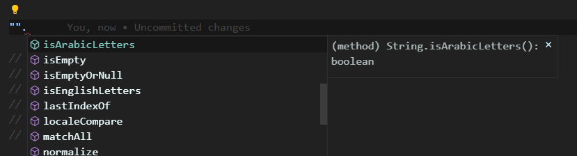

# Use Exten

## Installation

In a browser:

```html
<script src="use-exten/dist/arrays"></script>
<script src="use-exten/dist/objects"></script>
<script src="use-exten/dist/strings"></script>
<script src="use-exten/dist/numbers"></script>
<script src="use-exten/dist/dates"></script>
<script src="use-exten/dist/bools"></script>
<script src="use-exten/dist/functions"></script>
```

Using npm:

```shell
$ npm i -g npm
$ npm i use-exten
```

Using yarn:

```shell
$ npm i -g yarn
$ yarn add use-exten
```

Note: add `--save` if you are using npm < 5.0.0

In the root of your project files add:

```js
// adding array extensions
import "use-exten/dist/arrays";
// adding object extensions
import "use-exten/dist/objects";
// adding string extensions
import "use-exten/dist/strings";
// adding number extensions
import "use-exten/dist/numbers";
// adding date extensions
import "use-exten/dist/dates";
// adding bool extensions
import "use-exten/dist/bools";
// adding functions extensions
import "use-exten/dist/functions";
```

## Why use-exten?

use exten makes JavaScript easier by taking the hassle out of working with arrays,<br>
numbers, objects, strings,functions, etc. use exten’s modular methods are great for:

- Iterating arrays, objects, & strings
- Manipulating & testing values
- Creating composite functions


## Exampe?


